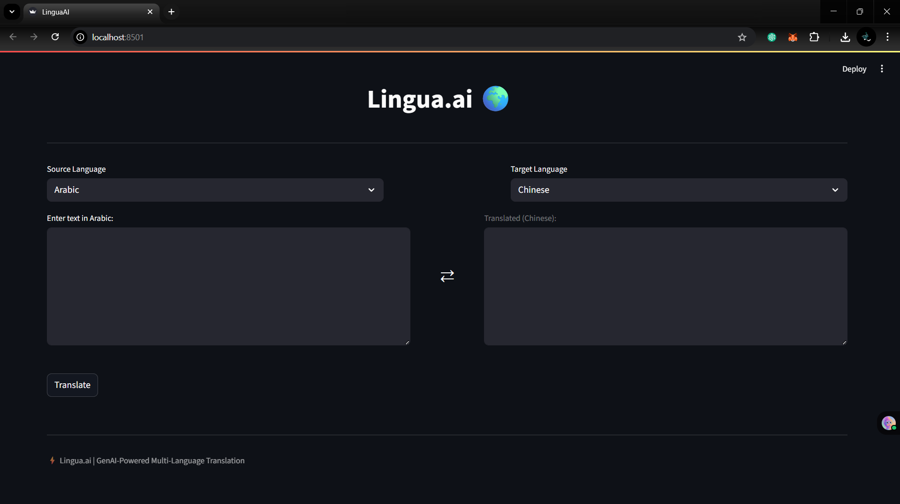
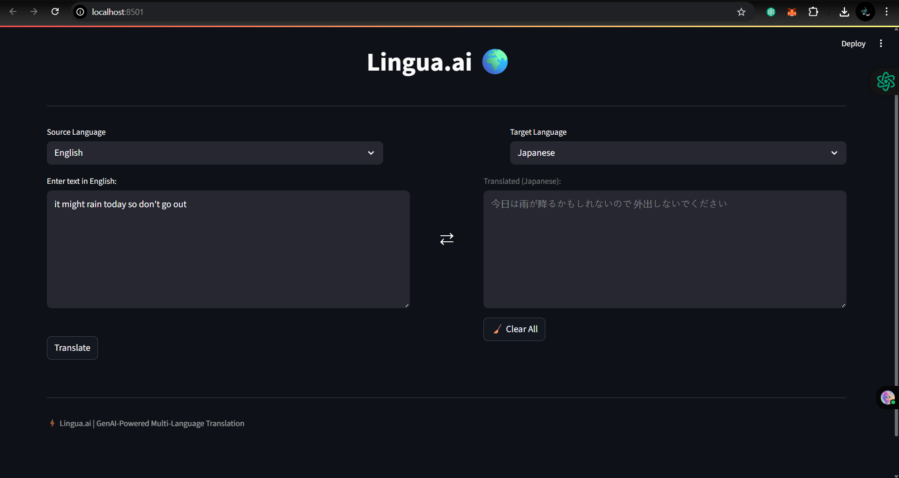

# 🌍 Lingua.ai - AI-Powered Multi-Language Translator

**Lingua.ai** is a Streamlit-based web application that provides seamless translation across multiple languages using generative AI. It uses the **MBART multilingual transformer model** from Hugging Face for high-quality translation, and features a clean, user-friendly UI.

---

## ✅ Features

- 🔤 Translate between **language pairs**
- ⚡ Powered by **MBART (facebook/mbart-large-50-many-to-many-mmt)**
- 🧠 Built with **Transformers, PyTorch, and Streamlit**
- 📝 Intuitive dual-pane UI for input/output like Google Translate
- 🧹 "Clear All" functionality

---

## 📁 Project Structure

```
multi-lang-translator/
├── app.py                  # Streamlit frontend
├── translator.py           # Core translation logic using MBART
├── utils/
│   ├── language_utils.py   # Language mapping and model selection
├── requirements.txt       
├── .gitignore
└── README.md             
```

---

## Demo

### 🔗 Check the app in action here:

[Live Demo on Streamlit](https://lingua-ai-translator.streamlit.app/)



*Figure 1: Lingua.ai - Multi language translator UI*


*Figure 2: Language Selection*


*Figure 3: English to Japanese Translation*


*Figure 4: English to Hindi Translation*

---


## 🚀 How to Run Locally

### 1. Clone the Repository

```bash
git clone https://github.com/sgupta701/Lingua.ai.git
cd multi-lang-translator
```

### 2. Create Virtual Environment

```bash
python -m venv venv
venv\Scripts\activate  # Windows
# or
source venv/bin/activate  # macOS/Linux
```

### 3. Install Requirements

```bash
pip install --upgrade pip
pip install -r requirements.txt
```

> 💡 PyTorch (CPU version) should be installed like this:

```bash
pip install torch torchvision torchaudio --index-url https://download.pytorch.org/whl/cpu
```

### 4. Run the App

```bash
streamlit run app.py
```

---

## ✨ Future Enhancements

- 🎛️ Tone/formality selection via LLM-based rephrasing
- 🔊 Text-to-speech (TTS) integration
- 🎙️ Voice input (Whisper/Vosk)
- 📁 File translation upload
- ⬇️ Download translated output

---

## 📜 License

built for learning and demonstration. Free to use, modify, and deploy.

---
