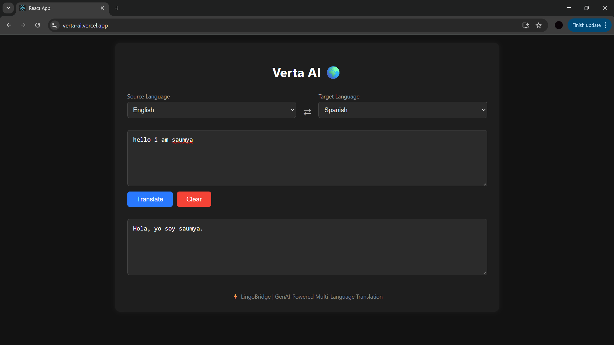
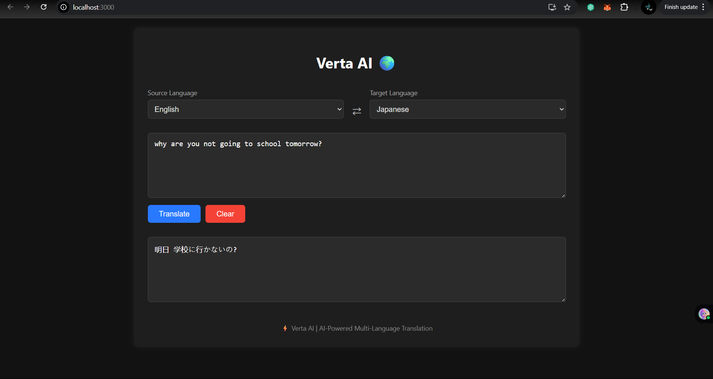
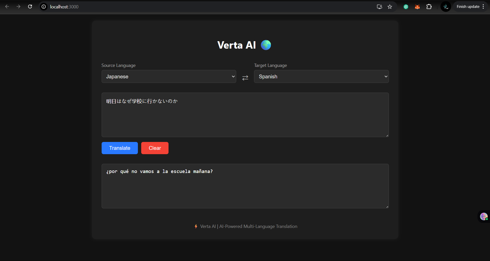
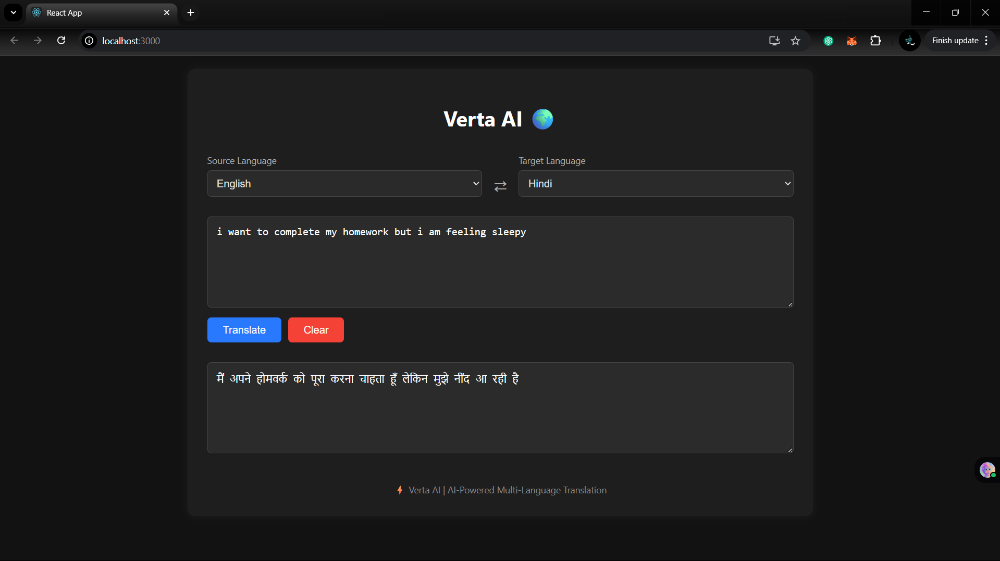
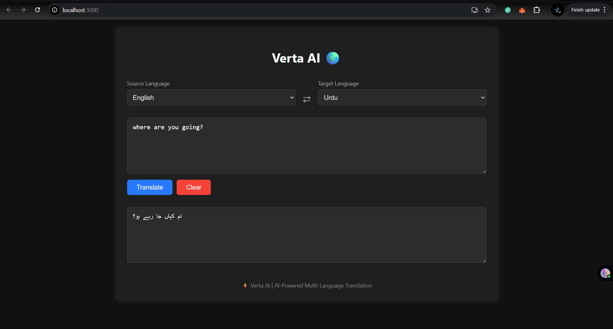

# 🌍 Verta AI - AI-Powered Multi-Language Translator

**Verta AI** is a full-stack AI-powered web application for real-time multilingual text translation using Hugging Face’s **MBART transformer model**. It features a clean interface, developed with **React** (frontend) and **FastAPI** (backend), and deployable using **Vercel** and **Render**.

---

## ✅ Features

- 🌐 Translate across **English, Hindi, Japanese, Spanish, and Urdu**
- ⚙️ Powered by **facebook/mbart-large-50-many-to-many-mmt**
- 🧠 Built using **Transformers, PyTorch, FastAPI, React**
- 🔤 Responsive dual-pane UI for input/output

---

## 📸 Live Demo

Google Drive : [click here](https://drive.google.com/file/d/1MSSlnKq5SAocXPTalaukXjLYlJ92JEoT/view?usp=drive_link)

Screenshots:

<p align="center">
  
  <br>
  <em>Figure 1: User Interface of Verta AI</em>
</p>
<p align="center">
  
  <br>
  <em>Figure 2: English to Japanese translation</em>
</p>
<p align="center">
  
  <br>
  <em>Figure 3: Japanese to Spanish translation</em>
</p>
<p align="center">
  
  <br>
  <em>Figure 4: English to Hindi translation</em>
</p>
<p align="center">
  
  <br>
  <em>Figure 5: English to Urdu translation</em>
</p>

## Try it out on:

[https://verta-ai.vercel.app](https://verta-ai.vercel.app)

---

## 🧠 Tech Stack

| Layer      | Technology                     |
|------------|--------------------------------|
| Frontend   | React, Axios, HTML/CSS         |
| Backend    | FastAPI, Transformers, PyTorch |
| ML Model   | MBART (Multilingual BART)      |
| Deployment | Vercel (frontend), Render (backend) |

---

## 🗂️ Project Structure

```
multi-lang-translator/
├── backend/
│   └── app/
│       ├── main.py              # FastAPI server
│       ├── translator.py        # Translation logic
│       └── utils/
│           └── language_utils.py# Language/model config
│   └── requirements.txt
│
├── frontend/
│   ├── public/
│   └── src/
│       ├── App.js               # React frontend
│       └── styles.css           # Custom CSS styling
│   └── package.json
│
├── .gitignore
└── README.md
```

---

## 🚀 Local Setup Instructions

### 🔧 1. Clone the Repository

```bash
git clone https://github.com/sgupta701/Verta-AI.git
cd multi-lang-translator
```

---

### 🧠 2. Backend Setup (FastAPI)

```bash
cd backend
python -m venv venv
venv\Scripts\activate         # Windows
# or
source venv/bin/activate       # macOS/Linux
pip install -r requirements.txt
```

> 💡 Install PyTorch manually if needed:
```bash
pip install torch torchvision torchaudio --index-url https://download.pytorch.org/whl/cpu
```

Run backend:

```bash
uvicorn app.main:app --reload
```

✅ API will be available at: `http://localhost:8000`

---

### 💻 3. Frontend Setup (React)

```bash
cd frontend
npm install
npm start
```

✅ Frontend will run at: `http://localhost:3000`

---

## 🌐 Supported Language Pairs

| Source Language | Target Languages                      |
|-----------------|----------------------------------------|
| English         | Hindi, Japanese, Spanish, Urdu         |
| Hindi           | English, Japanese, Spanish             |
| Japanese        | English, Hindi, Spanish, Urdu          |
| Spanish         | English, Hindi, Japanese, Urdu         |
| Urdu            | English, Hindi, Spanish, Japanese      |

> ❌ **Hindi → Urdu** is intentionally blocked to avoid poor model performance.

---

## 🌟 Planned Enhancements

- 🎛️ Tone/Formality selector via LLM rephrasing
- 🔉 Text-to-Speech (TTS) support
- 📁 File translation support (PDF, DOCX, TXT)
- 🎙️ Voice input (using Whisper/Vosk)
- ⬇️ Download translated output

---

## 📜 License

This project is for educational and demonstration purposes.  
Feel free to use, modify, and deploy it.

---

## 👩‍💻 Author

**Saumya Gupta**  
📫 [GitHub](https://github.com/sgupta701)

---
